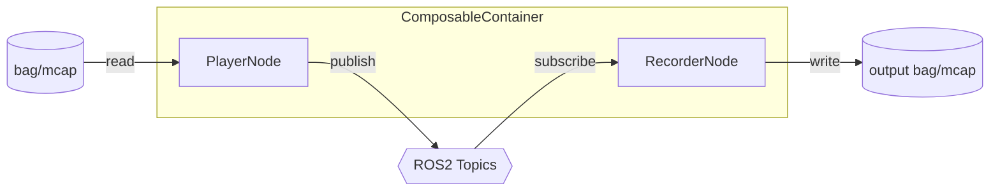

# composable_player API

## Architecture



## Components

### composable_player::PlayerNode

Reads MCAP/rosbag files and publishes serialized messages on original topics.

#### Parameters

| Name | Type | Default | Description |
|---|---|---|---|
| `bag_uri` | string | **required** | Bag file/directory path |
| `storage_id` | string | `"mcap"` | Storage plugin: `mcap` or `sqlite3` |
| `rate` | double | `1.0` | Playback speed multiplier |
| `loop` | bool | `false` | Loop playback on completion |
| `start_paused` | bool | `false` | Start in paused state |
| `topics` | string[] | `[]` | Topic filter (empty = all) |

#### Services

| Name | Type | Description |
|---|---|---|
| `~/pause` | `std_srvs/srv/Trigger` | Pause playback |
| `~/resume` | `std_srvs/srv/Trigger` | Resume playback |

#### Published Topics

Dynamic — mirrors topics from the source bag file.

---

### composable_player::RecorderNode

Subscribes to ROS2 topics and writes serialized messages to MCAP/rosbag files.

#### Parameters

| Name | Type | Default | Description |
|---|---|---|---|
| `output_uri` | string | **required** | Output bag path |
| `storage_id` | string | `"mcap"` | Storage plugin: `mcap` or `sqlite3` |
| `topics` | string[] | `[]` | Topics to record |
| `all_topics` | bool | `false` | Discover and record all topics |
| `exclude_topics` | string[] | `["/rosout", "/parameter_events"]` | Topics to exclude when `all_topics=true` |

#### Services

| Name | Type | Description |
|---|---|---|
| `~/stop` | `std_srvs/srv/Trigger` | Stop recording and flush |

#### Subscribed Topics

Dynamic — determined by `topics` parameter or topic discovery.

---

## Usage

### Standalone Player

```bash
ros2 launch composable_player player.launch.py bag_uri:=/path/to/bag
```

### Standalone Recorder

```bash
ros2 launch composable_player recorder.launch.py output_uri:=/path/to/output
```

### Composable Container (Single Process)

```bash
ros2 launch composable_player composable.launch.py \
  bag_uri:=/path/to/input \
  output_uri:=/path/to/output
```

### Runtime Component Loading

```bash
ros2 run rclcpp_components component_container

ros2 component load /ComponentManager composable_player composable_player::PlayerNode \
  -p bag_uri:=/path/to/bag -p rate:=2.0

ros2 component load /ComponentManager composable_player composable_player::RecorderNode \
  -p output_uri:=/path/to/output -p all_topics:=true
```

### Service Calls

```bash
ros2 service call /player/pause std_srvs/srv/Trigger
ros2 service call /player/resume std_srvs/srv/Trigger
ros2 service call /recorder/stop std_srvs/srv/Trigger
```

## Storage Formats

| `storage_id` | Format | Extension |
|---|---|---|
| `mcap` | MCAP | `.mcap` |
| `sqlite3` | ROS2 bag (SQLite3) | `.db3` |
