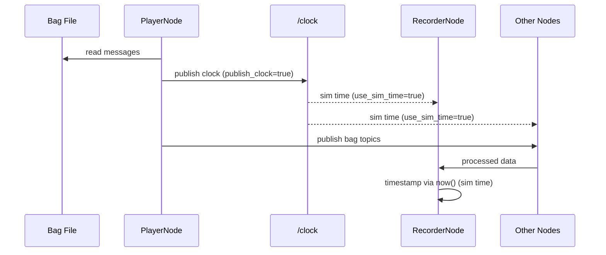

# composable_player API

## Architecture

```mermaid
graph LR
    subgraph ComposableContainer
        P[PlayerNode]
        R[RecorderNode]
    end
    BAG[(bag/mcap)] -->|read| P
    P -->|publish| TOPICS{{ROS2 Topics}}
    P -->|publish_clock| CLK[/clock]
    CLK -.->|use_sim_time| R
    TOPICS -->|subscribe| R
    R -->|write| OUT[(output bag/mcap)]
```

## Components

### composable_player::PlayerNode

Reads MCAP/rosbag files and publishes serialized messages on original topics.

#### Parameters

| Name | Type | Default | Description |
|---|---|---|---|
| `bag_uri` | string | **required** | Bag file/directory path |
| `storage_id` | string | `"mcap"` | Storage plugin: `mcap` / `sqlite3` |
| `rate` | double | `1.0` | Playback speed multiplier |
| `loop` | bool | `false` | Loop on completion |
| `start_paused` | bool | `false` | Start paused |
| `topics` | string[] | `[]` | Topic filter (empty = all) |
| `use_sim_time` | bool | `false` | Use `/clock` for `now()` |
| `publish_clock` | bool | `false` | Publish `/clock` from playback time |
| `clock_frequency` | double | `100.0` | `/clock` publish rate (Hz) |

#### Services

| Name | Type | Description |
|---|---|---|
| `~/pause` | `std_srvs/srv/Trigger` | Pause playback |
| `~/resume` | `std_srvs/srv/Trigger` | Resume playback |

#### Published Topics

| Name | Type | Condition |
|---|---|---|
| *(from bag)* | *(original types)* | Always |
| `/clock` | `rosgraph_msgs/msg/Clock` | `publish_clock=true` |

---

### composable_player::RecorderNode

Subscribes to ROS2 topics and writes serialized messages to MCAP/rosbag files.

#### Parameters

| Name | Type | Default | Dynamic | Description |
|---|---|---|---|---|
| `output_uri` | string | **required** | No | Output bag path |
| `storage_id` | string | `"mcap"` | No | Storage plugin: `mcap` / `sqlite3` |
| `topics` | string[] | `[]` | **Yes** | Topics to record |
| `all_topics` | bool | `false` | **Yes** | Discover and record all topics |
| `exclude_topics` | string[] | `["/rosout", "/parameter_events"]` | **Yes** | Exclude list (`all_topics` mode) |
| `use_sim_time` | bool | `false` | No | Use `/clock` for message timestamps |
| `max_bag_size` | int | `0` | No | Max file size bytes (0 = unlimited) |
| `max_bag_duration` | int | `0` | No | Max duration nanoseconds (0 = unlimited) |

Dynamic parameters can be changed at runtime via `ros2 param set`.

#### Services

| Name | Type | Description |
|---|---|---|
| `~/stop` | `std_srvs/srv/Trigger` | Stop recording and flush |

#### Subscribed Topics

Dynamic — determined by `topics` parameter or topic discovery.

---

## Usage

### Standalone Player

```bash
ros2 launch composable_player player.launch.py bag_uri:=/path/to/bag
```

### Player with sim time

```bash
ros2 launch composable_player player.launch.py \
  bag_uri:=/path/to/bag \
  publish_clock:=true \
  use_sim_time:=false
```

### Standalone Recorder

```bash
ros2 launch composable_player recorder.launch.py \
  output_uri:=/path/to/output
```

### Recorder with specific topics

```bash
ros2 launch composable_player recorder.launch.py \
  output_uri:=/path/to/output \
  all_topics:=false

ros2 param set /recorder topics "['/camera/image', '/imu/data', '/lidar/points']"
```

### Composable Container (Single Process)

```bash
ros2 launch composable_player composable.launch.py \
  bag_uri:=/path/to/input \
  output_uri:=/path/to/output \
  use_sim_time:=true \
  publish_clock:=true
```

### Runtime Component Loading

```bash
ros2 run rclcpp_components component_container

ros2 component load /ComponentManager composable_player composable_player::PlayerNode \
  -p bag_uri:=/path/to/bag -p rate:=2.0 -p publish_clock:=true

ros2 component load /ComponentManager composable_player composable_player::RecorderNode \
  -p output_uri:=/path/to/output -p all_topics:=true -p use_sim_time:=true
```

### Dynamic Topic Update

```bash
ros2 param set /recorder topics "['/topic_a', '/topic_b']"
ros2 param set /recorder all_topics true
ros2 param set /recorder exclude_topics "['/rosout']"
```

### Service Calls

```bash
ros2 service call /player/pause std_srvs/srv/Trigger
ros2 service call /player/resume std_srvs/srv/Trigger
ros2 service call /recorder/stop std_srvs/srv/Trigger
```

## use_sim_time Sequence



## Storage Formats

| `storage_id` | Format | Extension |
|---|---|---|
| `mcap` | MCAP | `.mcap` |
| `sqlite3` | ROS2 bag (SQLite3) | `.db3` |
